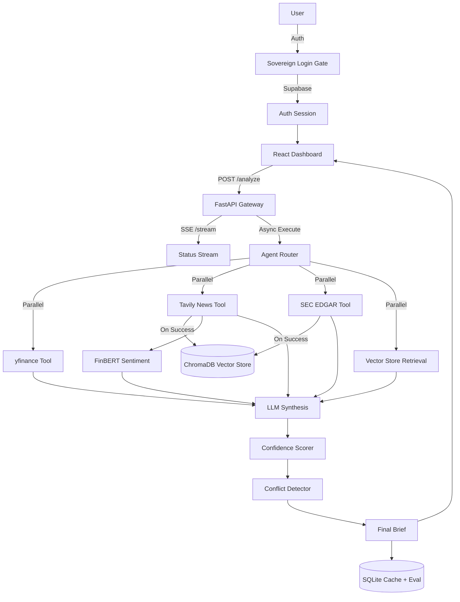

# FinSight Agent

**Autonomous Stock Intelligence & Signal Synthesis System**

FinSight is a professional-grade autonomous agent that retrieves, analyzes, and synthesizes financial data from multiple fragmented sources. It doesn't just fetch data; it reasons over it like a junior equity analyst to produce a structured **Bull vs Bear Brief** with grounded confidence scores and explicit conflict detection.

---

## The Core Difference

Most financial RAG (Retrieval-Augmented Generation) systems simply blend all retrieved text into a single summary. **FinSight is different:**

1. **Autonomous Tool-Calling**: The agent (powered by Gemini or Llama 3) autonomously decides which tools to invoke (SEC filings, news, technicals) based on the ticker's context.
2. **Conflict Detection**: Explicitly surfaces when sources disagree (e.g., "News is bullish, but RSI indicates the stock is overbought").
3. **Semantic Document Memory**: Uses a local **ChromaDB** vector store to embed news and SEC filings. This enables semantic fallback if live APIs fail and allows the agent to recall past research.
4. **Mathematical Confidence**: Confidence isn't a "vibe" generated by the LLM. It's computed based on source agreement and **Time-Based Staleness Penalties** (algorithmic decay for older data).
5. **Graceful Degradation**: Built to handle the unreliability of free-tier APIs. If a live fetch fails, the agent cascades to a vector store retrieval or SQLite cache.

---

## Tech Stack

### Backend (Python/FastAPI)
- **Agent Orchestration**: Custom async router with parallel tool execution via `asyncio`.
- **LLM Support**: **Gemini** (`gemini-flash-latest`, primary) → **Groq** (`llama-3.3-70b-versatile`) → **Local HuggingFace** (`meta-llama/Llama-3.2-3B-Instruct`) — automatic fallback chain.
- **Vector Memory**: **ChromaDB** with `all-MiniLM-L6-v2` embeddings for semantic search and fallback.
- **Data Tools**: `yfinance` (Price/Technicals), `Tavily` (News Search), `SEC EDGAR` (Filings).
- **Sentiment Analysis**: Local `FinBERT` model for high-fidelity financial sentiment scoring.
- **Storage**: SQLite for result caching, brief history, watchlist, and the **Eval Layer** (Signal Tracking).

### Frontend (React/Vite)
- **Sovereign Login Gate**: High-fidelity, 3-panel authentication interface with biometric-inspired animations.
- **Supabase Integration**: Production-ready user authentication and session management.
- **Real-time Streaming**: SSE (Server-Sent Events) allows you to watch the agent work in real-time as each tool completes.
- **Terminal UI**: Dark-mode dashboard inspired by professional Bloomberg/Refinitiv terminals.
- **Views**: Dashboard · Watchlist · Signals · Reports · Eval Leaderboard
- **Markdown Export**: Download any brief as a formatted `.md` file.

---

## Architecture



FinSight is built on a modular **5-Layer Architecture**:

1. **Security & Identity Layer (Supabase)**: Handles user authentication, registration, and session persistence.
2. **Presentation Layer (React)**: A terminal-inspired dashboard that consumes an SSE stream for real-time tool status feedback.
3. **Agentic Orchestration Layer (FastAPI + Router)**: An async routing engine that uses an LLM to decide which tools to fire, with parallel execution and fallback cascades.
4. **Intelligence & Tooling Layer**: SEC EDGAR, Tavily, yfinance, and local FinBERT sentiment analysis.
5. **Storage & Memory Layer**: ChromaDB (Semantic Memory), SQLite (Cache, Brief History, Watchlist & Signal Tracking).

---

## Quick Start

### 1. Prerequisites
- Python 3.11+
- Node.js 18+
- Supabase Account (for Authentication)

### 2. Backend Setup
```bash
cd backend
python -m venv .venv
source .venv/bin/activate  # Windows: .venv\Scripts\activate
pip install -r requirements.txt
```

### 3. Frontend Setup
```bash
cd frontend
npm install
```

### 4. Environment Variables

**Backend (`backend/.env`):**
```env
LLM_PROVIDER=gemini          # gemini | groq | local | fallback
GEMINI_API_KEY=your_key_here
GROQ_API_KEY=your_key_here
HF_TOKEN=your_key_here       # HuggingFace token (required for gated local models)
TAVILY_API_KEY=your_key_here
SEC_USER_AGENT=YourApp your@email.com
```

**Frontend (`frontend/.env`):**
```env
VITE_SUPABASE_URL=your_project_url
VITE_SUPABASE_ANON_KEY=your_anon_key
```

### 5. Running the App

```bash
# Backend (from backend/)
uvicorn main:app --reload

# Frontend (from frontend/)
npm run dev
```

---

## API Endpoints

| Method | Endpoint | Description |
|---|---|---|
| `POST` | `/analyze` | Run full agent pipeline, returns Bull/Bear brief |
| `GET` | `/stream/{ticker}` | SSE stream — real-time tool status + final brief |
| `GET` | `/brief/{ticker}` | Fetch latest cached brief for a ticker |
| `GET` | `/briefs/history` | Full brief history (all tickers) |
| `GET` | `/briefs/{ticker}/all` | All briefs for a specific ticker |
| `GET` | `/briefs/id/{id}` | Fetch a specific brief by ID |
| `GET` | `/watchlist` | Get all watchlist items with brief summaries |
| `POST` | `/watchlist` | Add ticker to watchlist |
| `DELETE` | `/watchlist/{ticker}` | Remove ticker from watchlist |
| `PATCH` | `/watchlist/{ticker}` | Update notes for a watchlist item |
| `PUT` | `/watchlist/reorder` | Reorder watchlist items |
| `GET` | `/eval/leaderboard` | Aggregate signal accuracy stats |
| `GET` | `/eval/details` | Detailed evaluated signal history |
| `POST` | `/eval/run` | Force-run evaluation on ready briefs |
| `GET` | `/health` | Health check + active LLM provider |

---

## Roadmap & Project Status

- [x] **Phase 1: Core Agent** — Tool calling & basic brief generation.
- [x] **Phase 2: Signal Detection** — Conflict detector & SEC integration.
- [x] **Phase 3: Resilience** — Failure handling, Cache TTL, and Vector Memory (ChromaDB).
- [x] **Phase 4: Frontend** — Real-time terminal dashboard with SSE.
- [x] **Phase 5: Identity** — Sovereign Login Gate & Supabase Auth integration.
- [x] **Phase 6: Eval Layer** — Automated 5-day price tracking and accuracy leaderboard.
- [ ] **Phase 7: Deployment** — Cloud deployment via Railway/Vercel.

---

## Evaluation Methodology

FinSight tracks its own accuracy. Every brief is logged and eventually graded against the actual stock price 5 trading days later. A "Correct" signal is defined as a ≥1% move in the signaled direction.

---

*Built for portfolio demonstration and rigorous financial signal analysis.*
